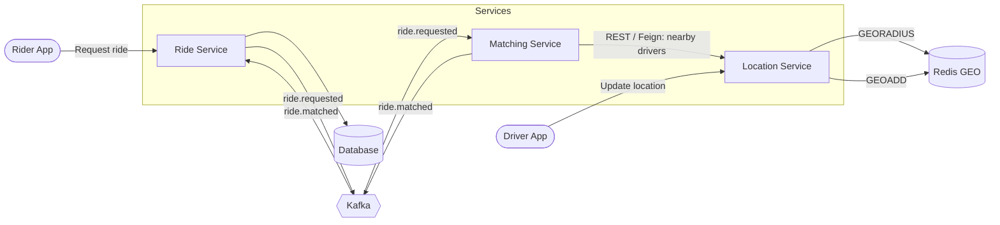
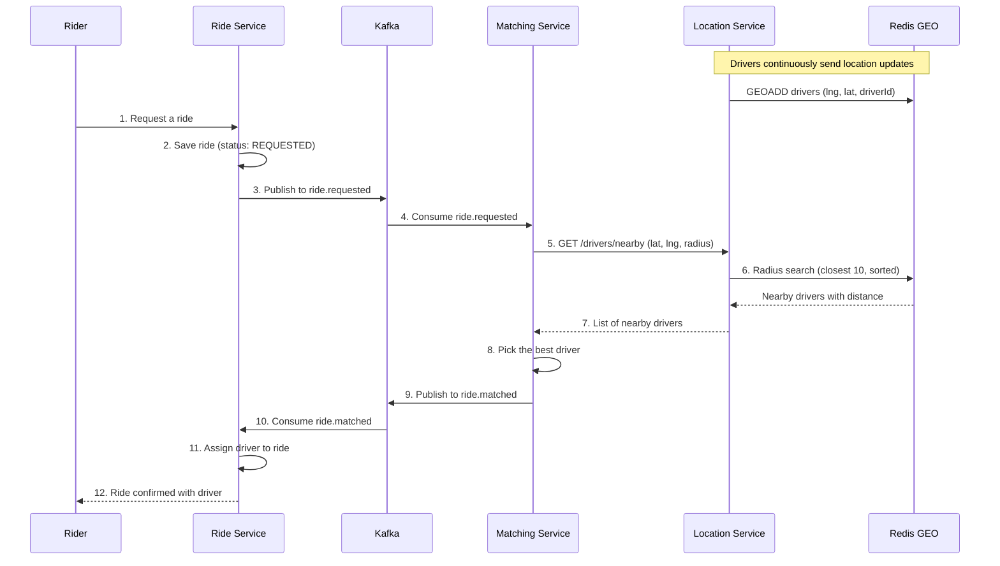

# Uber App: Ride-Sharing Backend

> **How does Uber find drivers so quickly?**
> A microservices backend that matches riders with nearby drivers in real time using **Redis GEO**, **Kafka**, and **Spring Boot**.

---

## Table of Contents

- [Overview](#overview)
- [Tech Stack](#tech-stack)
- [Architecture](#architecture)
- [Ride Flow](#ride-flow)
- [Services](#services)
- [Kafka Topics](#kafka-topics)
- [Project Structure](#project-structure)
- [Getting Started](#getting-started)
- [Generate Test Driver Data](#generate-test-driver-data)
- [API Endpoints](#api-endpoints)
- [Key Design Decisions](#key-design-decisions)
- [Future Improvements](#future-improvements)

---

## Overview

This project simulates the core backend of a ride-hailing platform. It is split into three independent services that communicate in two ways:

- **Synchronously** over REST (OpenFeign), when an immediate answer is needed (e.g., "which drivers are nearby?").
- **Asynchronously** over Kafka events, when services should be decoupled (e.g., "a ride was requested", "a driver was matched").

## Tech Stack

| Layer | Technology |
|---|---|
| Language / Framework | Java, Spring Boot |
| Geospatial store | Redis (GEO commands) |
| Messaging | Apache Kafka |
| Service-to-service calls | Spring Cloud OpenFeign |
| Persistence | Spring Data JPA (`<your database here>`) |
| Containerization | Docker, Docker Compose |

## Architecture



## Ride Flow



### Flow in plain steps

1. A **driver** sends location updates to the Location Service, which stores them in a Redis GEO set.
2. A **rider** requests a ride through the Ride Service.
3. The Ride Service saves the ride and publishes a `ride.requested` event to Kafka.
4. The Matching Service consumes the event and asks the Location Service for nearby drivers via a Feign client.
5. The Location Service runs a Redis radius query and returns the closest drivers, sorted by distance.
6. The Matching Service selects a driver and publishes a `ride.matched` event.
7. The Ride Service consumes `ride.matched` and assigns the driver to the ride.

## Services

### Ride Service
Owns the ride lifecycle.
- Creates rides and stores them in the database.
- Returns a rider's ride history (newest first).
- Publishes `ride.requested` events.
- Consumes `ride.matched` events and assigns the driver to the ride.

### Location Service
Owns real-time driver locations.
- Stores driver coordinates in a Redis GEO set.
- Finds drivers within a given radius, sorted by distance (closest 10).
- Exposes `GET /api/v1/locations/drivers/nearby`.

### Matching Service
Connects ride requests with drivers.
- Consumes `ride.requested` events.
- Calls the Location Service (via OpenFeign) to find nearby drivers.
- Publishes `ride.matched` events.

## Kafka Topics

| Topic | Producer | Consumer | Partitions | Purpose |
|---|---|---|---|---|
| `ride.requested` | Ride Service | Matching Service | 3 | A rider has requested a ride |
| `ride.matched` | Matching Service | Ride Service | 3 | A driver was found for the ride |

Consumer group for the Ride Service: `ride-service-group`.

## Project Structure

```
uber-app/
├── location-service/     # Redis GEO: store and search driver locations
├── matching-service/     # Consumes ride requests, finds and assigns drivers
├── ride-service/         # Ride lifecycle, Kafka producer and consumer
├── docker-compose.yaml   # Kafka, Redis, and other infrastructure
└── README.md
```

## Getting Started

### 1. Start the infrastructure

```bash
docker-compose up -d
```

This starts Kafka, Redis, and the other services defined in `docker-compose.yaml`.

### 2. Run each service

Open three terminals and run:

```bash
cd location-service && ./mvnw spring-boot:run
cd matching-service && ./mvnw spring-boot:run
cd ride-service     && ./mvnw spring-boot:run
```

> Use `./gradlew bootRun` instead if the project uses Gradle.

### 3. Configuration

Each service reads its settings from `application.yml` / `application.properties`. Key values:

| Property | Service | Example |
|---|---|---|
| `spring.data.redis.host` / `port` | Location | `localhost` / `6379` |
| `spring.kafka.bootstrap-servers` | Ride, Matching | `localhost:9092` |
| `location.service.url` | Matching | `http://localhost:<port>` |

## Generate Test Driver Data

To test nearby-driver search, you need many drivers at different locations. Instead of creating them one by one, generate them all at once with **[Mockaroo](https://www.mockaroo.com/)**, a free tool for creating realistic mock data.

### 1. Create the schema on Mockaroo

Open [mockaroo.com](https://www.mockaroo.com/) and add these fields:

| Field name | Type |
|---|---|
| `driverId` | Row Number (or Sequence) |
| `latitude` | Latitude |
| `longitude` | Longitude |


### 2. Export as JSON

- Set **# Rows** to how many drivers you want (e.g., `100`).
- Set **Format** to **JSON**.
- Click **Download Data**, and save the file as `drivers.json`.

Sample output:

```json
[
  { "driverId": "d1", "latitude": 23.014532, "longitude": 72.571208 },
  { "driverId": "d2", "latitude": 23.041877, "longitude": 72.602315 },
  { "driverId": "d3", "latitude": 22.998104, "longitude": 72.534962 }
]
```

### 3. Load all drivers into the Location Service

Send each driver to the Location Service so it is stored in Redis GEO. Send a POST request to the following endpoint:

```bash
http://localhost:8082/api/v1/locations/drivers/create
```

> Update the URL and the JSON field names to match your driver location update endpoint and request body.

### 4. Verify

```bash
curl "http://localhost:8082/api/v1/locations/drivers/nearby?latitude=23.0225&longitude=72.5714&radius=5"
```

You can also check Redis directly:

```bash
docker exec -it <redis-container> redis-cli
> ZCARD drivers:geo        # number of drivers stored (use your DRIVERS_GEO_KEY)
```

## API Endpoints

| Method | Endpoint | Service | Description |
|---|---|---|---|
| `GET` | `/api/v1/locations/drivers/nearby?latitude=&longitude=&radius=` | Location | Find the closest drivers within a radius (km) |
| `POST` | `/api/v1/rides/request` | Ride | Request a new ride |
| `GET` | `/api/v1/rides/rider/{riderId}` | Ride | Get a rider's ride history |
| `POST` | `/api/v1/locations/drivers/create` | Location | Add a driver's location |

**Example request**

```bash
curl "http://localhost:8082/api/v1/locations/drivers/nearby?latitude=23.0225&longitude=72.5714&radius=5"
```

**Example response**

```json
[
  { "driverId": "d42", "latitude": 23.0231, "longitude": 72.5720, "distance": 0.12 },
  { "driverId": "d17", "latitude": 23.0290, "longitude": 72.5801, "distance": 1.05 }
]
```

## Key Design Decisions

| Decision | Why |
|---|---|
| **Redis GEO for driver locations** | Radius queries run in memory and are far faster than scanning a relational table, which suits constantly changing locations. |
| **Kafka between Ride and Matching** | Decouples the services: the Ride Service doesn't wait for matching, and either side can be scaled or restarted independently. |
| **OpenFeign for Matching → Location** | Matching needs an immediate answer (nearby drivers), so a synchronous call is the better fit. |
| **3 partitions per topic** | Allows up to 3 consumer instances per group to process events in parallel. |
| **DTOs instead of entities** | Keeps the API contract separate from the database schema. |
